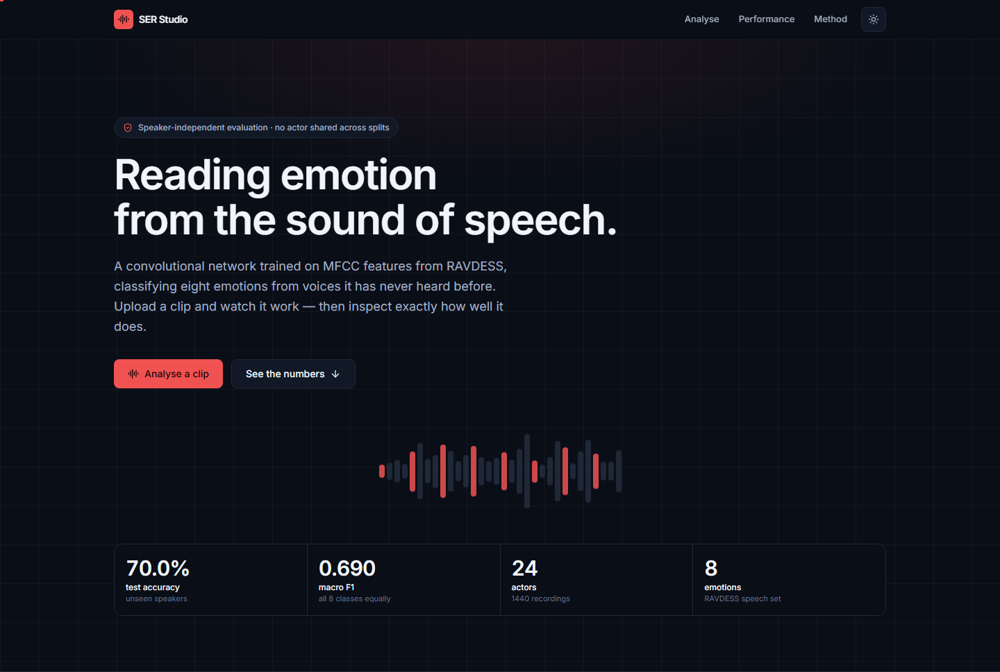
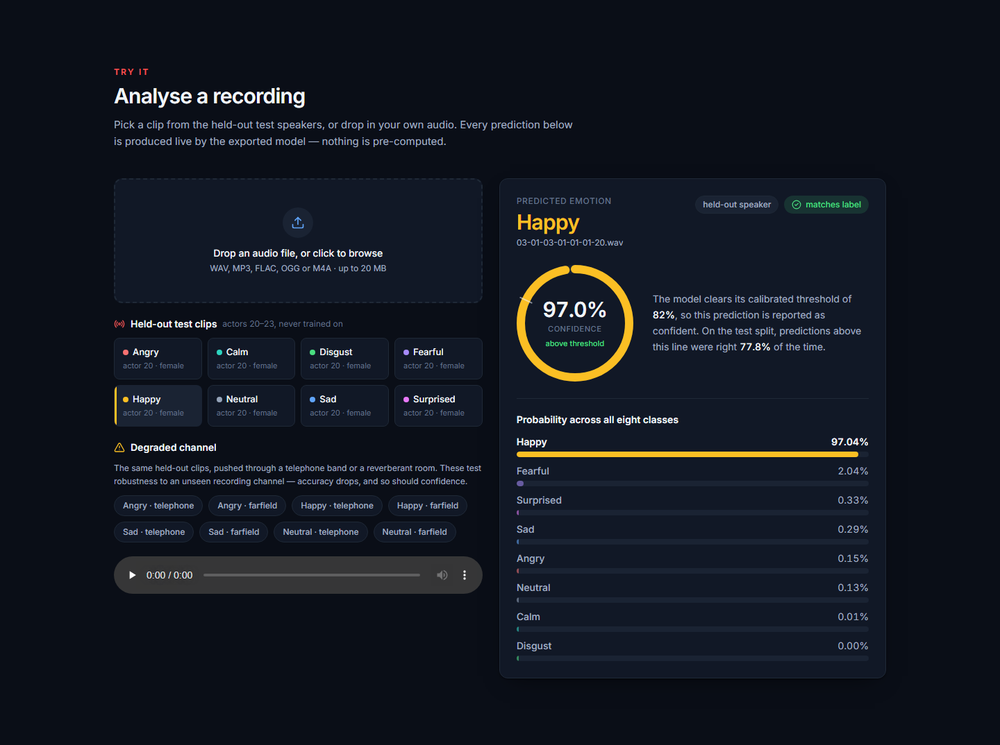
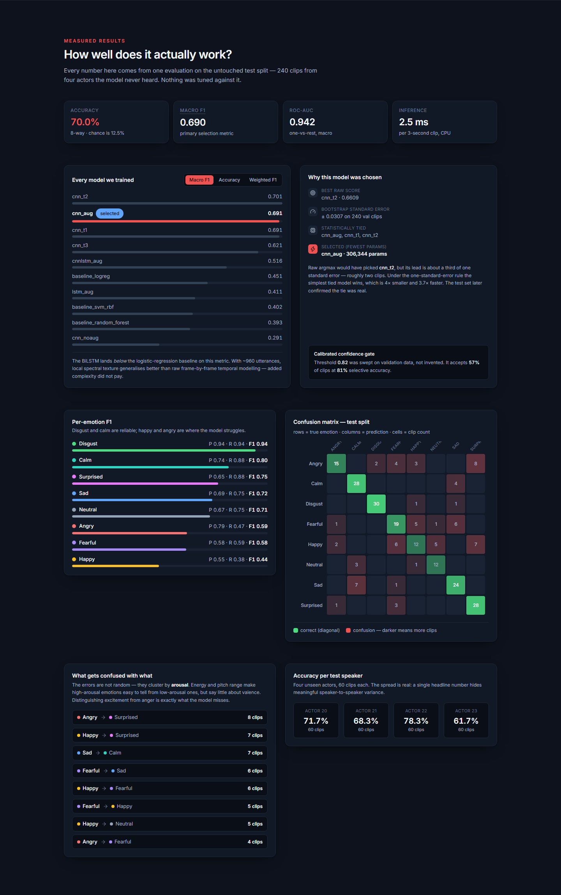
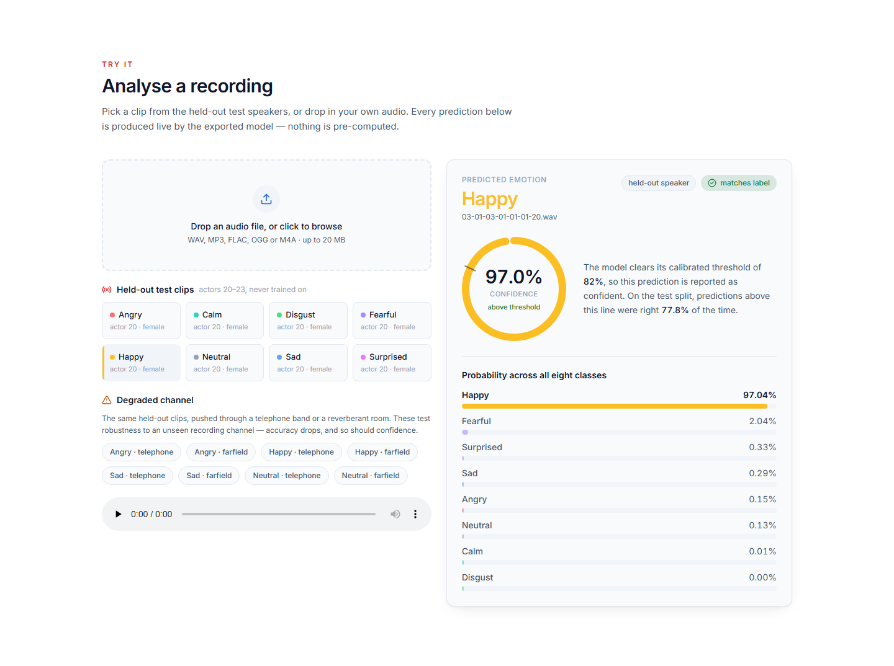
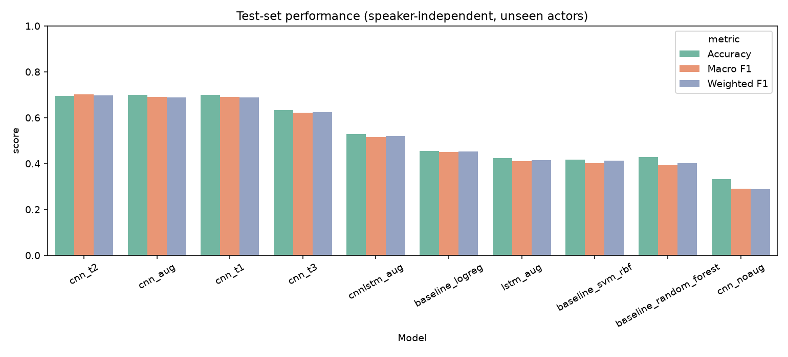
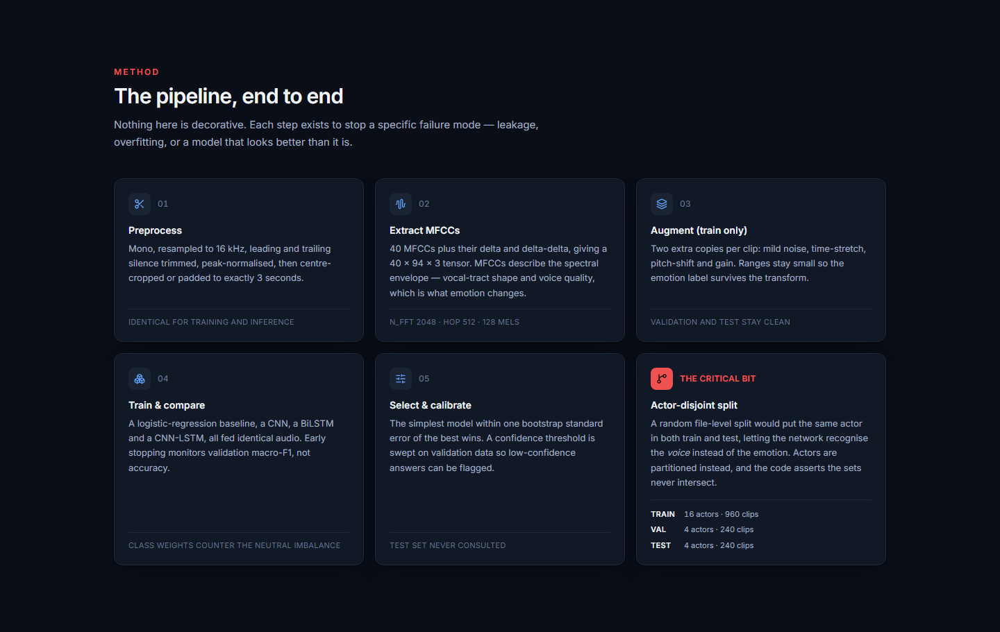
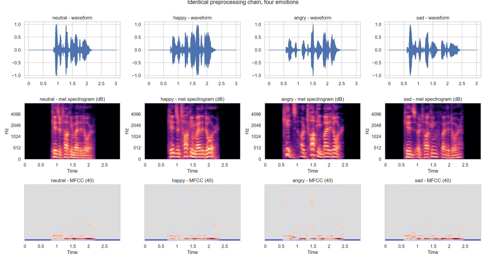
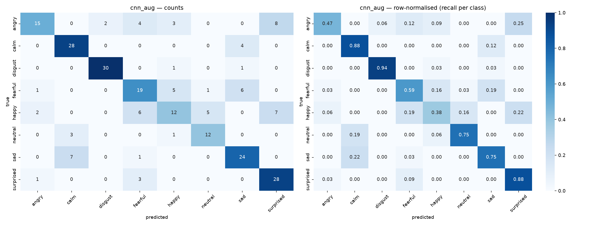
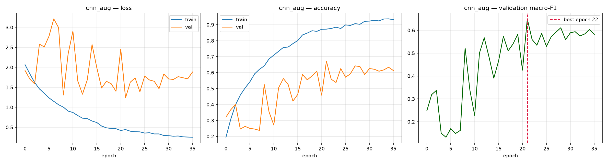
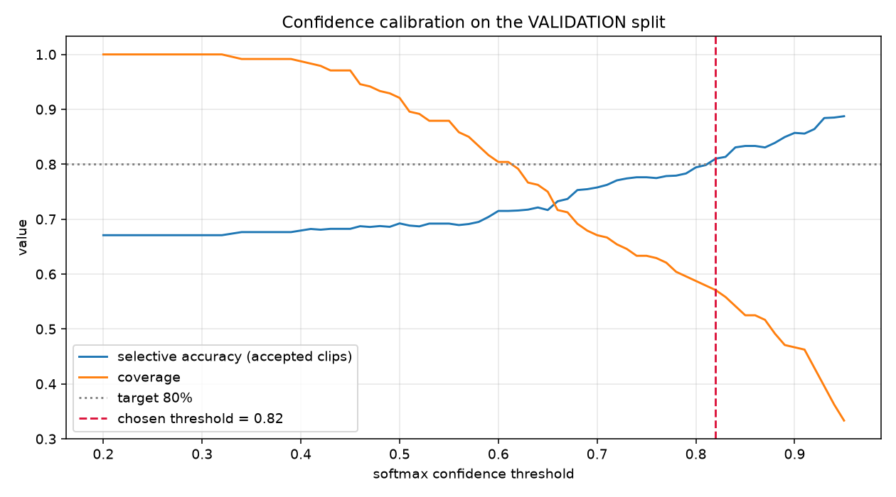

<div align="center">

# SER Studio

### Speech Emotion Recognition on RAVDESS

**Eight emotions, recognised from the sound of a voice the model has never heard before.**

[](https://www.python.org/)
[](https://www.tensorflow.org/)
[](https://librosa.org/)
[](https://react.dev/)
[](https://motion.dev/)
[](https://tailwindcss.com/)

[](#results)
[](#results)
[](#results)
[](#why-you-can-trust-these-numbers)
[](#licence--citation)



</div>

---

## Contents

| | |
|---|---|
| [Quick start](#quick-start) · [Try it in the browser](#try-it-in-the-browser) | Get it running |
| [Results](#results) · [Why you can trust these numbers](#why-you-can-trust-these-numbers) | What it achieves |
| [How it works](#how-it-works) · [What the model gets wrong](#what-the-model-gets-wrong) | How and why |
| [Project structure](#project-structure) · [Command reference](#command-reference) | Where things live |
| [Limitations](#limitations) · [Licence & citation](#licence--citation) | The honest caveats |

---

## Quick start

> **Note** — TensorFlow does not support Python 3.13 or 3.14. Use **Python 3.12**.

**1. Install**

```bash
python -m venv .venv
```

```bash
.venv\Scripts\python.exe -m pip install -r requirements.txt
```

**2. Get the dataset** (208 MB, unzip so you have `data/raw/RAVDESS/Actor_01/ … Actor_24/`)

```bash
curl -L -o data/raw/RAVDESS_speech.zip "https://zenodo.org/records/1188976/files/Audio_Speech_Actors_01-24.zip?download=1"
```

**3. Run the whole pipeline** — analysis, features, four models, evaluation, export

```bash
.venv\Scripts\python.exe src\run_all.py
```

Or skip training entirely and just use the exported model in `models/final_model/`.

---

## Try it in the browser

One command builds the front end and serves everything on a single port:

```bash
.venv\Scripts\python.exe run_webapp.py
```

Open **<http://127.0.0.1:5001>** — drop in your own audio, or click one of the
held-out test clips and watch the model classify it live.



Every prediction is computed live by the exported model — nothing on the page
is pre-baked. The ring shows confidence against a threshold **calibrated on
validation data**, so a weak prediction is reported as uncertain instead of
being asserted.

The same page presents the measured performance in full:



<details>
<summary><b>Light theme</b></summary>

Both themes are defined explicitly and the choice persists. Motion is used to
carry information — bars spring to their value, the ring sweeps to its arc,
metrics count up — and every animation is skipped for anyone who has
`prefers-reduced-motion` set.



</details>

<details>
<summary><b>Prefer the command line?</b></summary>

```bash
.venv\Scripts\python.exe src\predict.py path\to\your_recording.wav
```

```
Predicted Emotion  : SAD
Confidence         : 94.7%
Status             : confident

Emotion probabilities:
  sad         94.73%  ######################################
  calm         4.70%  ##
  neutral      0.28%
  ...
```

Add `--json` for machine-readable output, or use it from Python:

```python
from src.predict import EmotionRecognizer

rec = EmotionRecognizer()
result = rec.predict("my_clip.wav")
print(result["predicted_emotion"], result["confidence"])
print(result["probabilities"])
```

</details>

---

## Results

Scored **once**, on the untouched test split: 240 clips from four actors that
appear in no other partition.

| Model | Accuracy | Macro F1 | Weighted F1 | ROC-AUC |
|:---|---:|---:|---:|---:|
| **CNN + augmentation** *(selected)* | **0.700** | **0.690** | **0.689** | **0.942** |
| CNN-LSTM | 0.529 | 0.516 | 0.518 | 0.856 |
| Logistic regression *(baseline)* | 0.454 | 0.451 | 0.452 | 0.851 |
| BiLSTM | 0.425 | 0.411 | 0.414 | 0.815 |
| CNN, no augmentation | 0.333 | 0.291 | 0.287 | 0.846 |
| *Random chance* | *0.125* | — | — | *0.500* |



### Three findings worth pointing at

> **Augmentation was decisive — and partly for a non-obvious reason.**
> Same architecture, same settings: macro F1 went **0.291 → 0.690**. Chasing the
> no-augmentation collapse (train accuracy 0.72, validation 0.16, validation loss
> exploding to 4.4) uncovered a **BatchNorm moving-statistics failure**: at Keras'
> default momentum of 0.99 with only ~30 steps per epoch, the running statistics
> never converge, so training looks healthy while validation collapses. Dropping
> momentum to 0.90 lifted validation accuracy 0.579 → 0.642 on its own.

> **More complexity did not pay.** The BiLSTM scored *below* the logistic-regression
> baseline. With ~960 training utterances, local spectral texture generalises
> better than raw frame-by-frame temporal modelling.

> **The confidence gate works.** Thresholding at 0.82 raises test accuracy from
> **70.0% → 77.8%** on the 63.7% of clips it accepts.

<details>
<summary><b>Per-emotion breakdown</b></summary>

| Emotion | Precision | Recall | F1 | Support |
|:---|---:|---:|---:|---:|
| Disgust | 0.94 | 0.94 | **0.94** | 32 |
| Calm | 0.74 | 0.88 | **0.80** | 32 |
| Surprised | 0.65 | 0.88 | **0.75** | 32 |
| Sad | 0.69 | 0.75 | **0.72** | 32 |
| Neutral | 0.67 | 0.75 | **0.71** | 16 |
| Angry | 0.79 | 0.47 | **0.59** | 32 |
| Fearful | 0.58 | 0.59 | **0.58** | 32 |
| Happy | 0.55 | 0.38 | **0.44** | 32 |

</details>

---

## Why you can trust these numbers

This is the part that matters more than the headline score.

**Speakers never cross the split.** Actors 1–15 and 24 train, 16–19 validate,
20–23 test — each partition 50/50 male/female. A random file-level split would
put the same actor in both train and test, letting the network recognise the
*voice* rather than the *emotion* and inflating the score. `src/dataset.py`
**asserts** the actor sets do not intersect, so a future edit cannot quietly
reintroduce leakage.

**The test set was never used to decide anything.** Architecture,
hyper-parameters, augmentation and the confidence threshold were all chosen on
validation data.

**The final model was not picked by argmax.** Raw argmax would have chosen a
model scoring 0.6609 over one scoring 0.6502 — but a bootstrap puts the standard
error of validation macro-F1 at **±0.0307**, so that lead is about a third of one
standard error, roughly two clips. Under the **one-standard-error rule** the
simplest statistically-tied model wins: 4× fewer parameters, 3.7× faster. The
test set later confirmed the tie was real (0.690 vs 0.701).

**Preprocessing cannot drift.** The exported bundle stores its feature
configuration and `EmotionRecognizer` raises on mismatch, so a config change
fails loudly instead of producing quietly wrong predictions.

**Augmentation is training-only.** Validation and test audio is always clean.

---

## How it works



MFCCs describe the **spectral envelope** — vocal-tract shape and voice quality —
which is exactly what emotion alters (tense versus breathy phonation, formant
shifts, spectral tilt). The delta and delta-delta channels add how those
quantities change over time, capturing prosodic dynamics a single frame cannot.



| Stage | Setting |
|:---|:---|
| Audio | mono, 16 kHz, silence-trimmed (`top_db=30`), peak-normalised |
| Length | centre crop / symmetric pad to exactly 3.0 s (48 000 samples) |
| MFCC | `n_mfcc=40`, `n_fft=2048`, `hop=512`, `n_mels=128`, `fmin=20`, `fmax=8000` |
| CNN tensor | `(40, 94, 3)` — MFCC, Δ, ΔΔ |
| Sequence tensor | `(94, 120)` for the recurrent models |
| Augmentation | 2 extra copies: noise 15–30 dB SNR, time-stretch 0.9–1.1×, pitch ±2 semitones, gain ±6 dB |
| Imbalance | class weights (neutral has half the recordings of every other class) |

Ranges are deliberately mild — a large pitch shift or aggressive stretch starts
to *change* the perceived emotion, which would corrupt the very labels being
trained on.

---

## What the model gets wrong



The errors are **not random — they cluster by arousal**:

| True → Predicted | Clips | |
|:---|---:|:---|
| Angry → Surprised | 8 | high arousal |
| Happy → Surprised | 7 | high arousal |
| Sad → Calm | 7 | low arousal |
| Fearful → Sad | 6 | |
| Happy → Fearful | 6 | high arousal |
| Fearful → Happy | 5 | |
| Happy → Neutral | 5 | |

Energy, pitch range and speaking rate make high-arousal emotions easy to
separate from low-arousal ones — and say very little about **valence**.
Telling excitement from anger is precisely what this model misses, and it is a
known limit of acoustic-only speech emotion recognition.

<details>
<summary><b>Training curves and confidence calibration</b></summary>





The threshold is not invented. Candidate values are swept on validation data,
trading **coverage** (how many clips are accepted) against **selective accuracy**
(accuracy among the accepted ones). The smallest threshold reaching 80% selective
accuracy is chosen.

</details>

---

## Project structure

<details>
<summary><b>Expand the full tree</b></summary>

```
├── data/
│   ├── raw/RAVDESS/            # Actor_01 … Actor_24  (downloaded)
│   ├── processed/              # manifest.csv, cached .npz features, configs
│   └── external/               # drop your own recordings here
├── src/
│   ├── config.py               # every tunable constant in one place
│   ├── dataset.py              # filename parsing + actor-disjoint split
│   ├── audio_preprocessing.py  # load / trim / normalise / fix length
│   ├── feature_extraction.py   # MFCC, deltas, statistical descriptor
│   ├── augmentation.py         # train-only waveform augmentation
│   ├── models.py               # CNN, BiLSTM, CNN-LSTM
│   ├── train.py                # training loop + callbacks
│   ├── train_baseline.py       # LogReg / SVM / RandomForest
│   ├── tune.py                 # small hyper-parameter search
│   ├── finalize.py             # selection, calibration, export
│   ├── evaluate.py             # test metrics, confusion, ROC/PR, errors
│   ├── predict.py              # inference pipeline
│   ├── test_unseen_audio.py    # reload + unseen-audio demo
│   ├── make_external_demo.py   # simulated channel-degraded clips
│   ├── make_report.py          # builds report.md from metrics files
│   └── run_all.py              # end-to-end driver
├── webapp/
│   ├── backend/app.py          # Flask API + serves the built UI
│   └── frontend/               # React + Framer Motion source
├── models/
│   ├── baseline/ cnn/ lstm/ cnn_lstm/
│   └── final_model/            # model.keras + label encoder + configs + card
├── outputs/
│   ├── figures/                # 30 generated figures
│   ├── metrics/                # every number, as JSON/CSV
│   └── predictions/            # per-clip predictions, misclassified lists
├── scripts/capture_ui.py       # CDP screenshot tool for these docs
├── notebooks/emotion_recognition.ipynb
├── run_webapp.py
├── report.md                   # auto-generated from outputs/metrics/
└── requirements.txt
```

</details>

`report.md` is **generated** by `src/make_report.py` directly from the metrics
files, so the documentation cannot drift from the executed results.

---

## Command reference

<details>
<summary><b>Run any stage on its own</b></summary>

| Stage | Command |
|:---|:---|
| Dataset analysis + figures | `.venv\Scripts\python.exe src\analyze_dataset.py` |
| Feature extraction | `.venv\Scripts\python.exe src\build_features.py` |
| Classical baselines | `.venv\Scripts\python.exe src\train_baseline.py` |
| Train the CNN | `.venv\Scripts\python.exe src\train.py --model cnn --aug --tag cnn_aug` |
| Train the BiLSTM | `.venv\Scripts\python.exe src\train.py --model lstm --aug --tag lstm_aug` |
| Train the CNN-LSTM | `.venv\Scripts\python.exe src\train.py --model cnn_lstm --aug --tag cnnlstm_aug` |
| Hyper-parameter search | `.venv\Scripts\python.exe src\tune.py --model cnn` |
| Select + calibrate + export | `.venv\Scripts\python.exe src\finalize.py` |
| Test-set evaluation | `.venv\Scripts\python.exe src\evaluate.py` |
| Reload + unseen audio | `.venv\Scripts\python.exe src\test_unseen_audio.py` |
| Rebuild `report.md` | `.venv\Scripts\python.exe src\make_report.py` |
| Web app | `.venv\Scripts\python.exe run_webapp.py` |

Seed `42` is fixed for Python, NumPy and TensorFlow.

</details>

---

## Limitations

- **RAVDESS is acted emotion.** Two fixed, lexically neutral sentences, recorded
  in a studio by professional actors. Real spontaneous affect is subtler.
- **Sixteen training actors is few.** Per-speaker test accuracy spans
  **61.7% – 78.3%**, so the headline number carries real speaker-to-speaker variance.
- **Channel mismatch hurts.** On telephone-band and reverberant versions of the
  same clips, accuracy fell to 5/8 — though confidence fell with it, so the model
  became *uncertain* rather than confidently wrong.
- **Same-arousal pairs stay hard** (happy/surprised, sad/calm). A known ceiling
  for acoustic-only systems.
- **No real external microphone recording was tested.** Drop your own `.wav` files
  into `data/external/` and re-run `src/test_unseen_audio.py` to measure that.

---

## Why RAVDESS, and why not a mix

RAVDESS has **24 actors**, which is the only thing that makes "the test speakers
were unseen during training" a meaningful claim.

| | RAVDESS | TESS | EMO-DB |
|:---|:---|:---|:---|
| Recordings | 1440 speech | 2800 | 535 |
| Speakers | **24** (12M/12F) | 2 (both female) | 10 (5M/5F) |
| Speaker-independent split | **easy** | impossible | ~1 actor per fold |
| Class balance | 7×192 + neutral 96 | balanced | skewed 2.8× |

Datasets are deliberately **not combined**: label sets disagree (RAVDESS has
*calm* and *surprised*; EMO-DB has *boredom*), sample rates differ (48/24.4/16 kHz),
languages differ (English vs German), and recording chains differ. A merged corpus
would let a model partly identify the *dataset* instead of the *emotion*.

---

## Licence & citation

The **RAVDESS** dataset is released under **CC BY-NC-SA 4.0** (non-commercial).

> Livingstone SR, Russo FA (2018). *The Ryerson Audio-Visual Database of Emotional
> Speech and Song (RAVDESS)*. PLoS ONE 13(5): e0196391.
> <https://doi.org/10.1371/journal.pone.0196391>

<div align="center">

**Full analysis:** [`report.md`](report.md) · **Web app details:** [`webapp/README.md`](webapp/README.md) · **Notebook:** [`notebooks/emotion_recognition.ipynb`](notebooks/emotion_recognition.ipynb)

</div>
