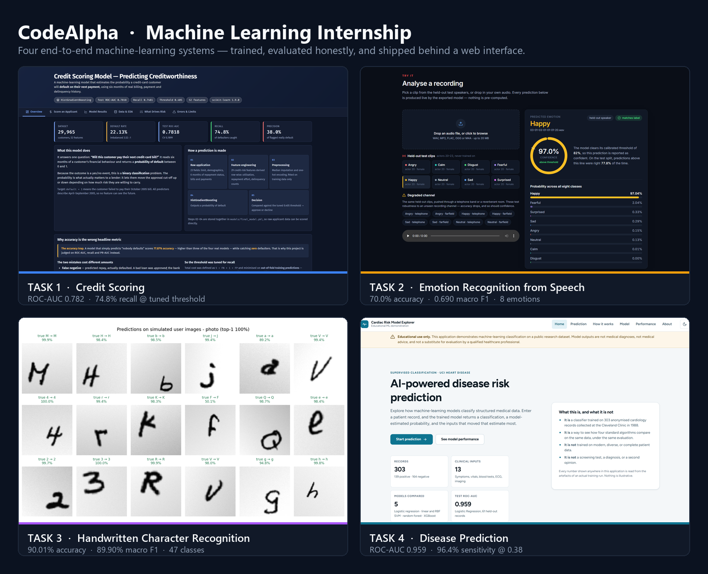
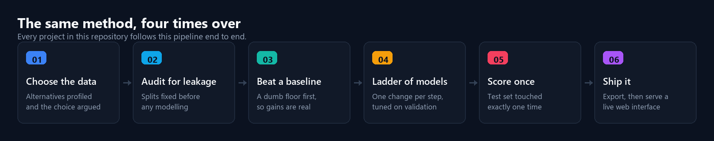

<div align="center">

# CodeAlpha — Machine Learning Internship

### Four end-to-end machine-learning systems

Each task is a **complete project, not a notebook** — the dataset choice is argued, leakage is
audited, a baseline is beaten, models are compared under one honest evaluation, and the winner
is exported and served behind a live web interface where **every number on screen is read from
the training run**.

[](https://www.python.org/)
[](https://scikit-learn.org/)
[](https://www.tensorflow.org/)
[](https://xgboost.readthedocs.io/)
[](https://opencv.org/)
[](https://react.dev/)

[](#the-four-tasks)
[](#the-four-tasks)
[](#what-they-share)

<br>



</div>

---

## The four tasks

| | Task | What it does | Headline result | Read more |
|:---:|---|---|---|---|
| **1** | **Credit Scoring** | Predicts the probability a credit-card customer defaults on their next payment, from six months of billing, payment and delinquency history. | **0.7818** test ROC-AUC · **74.8%** recall at the tuned threshold | [README](credit%20scoring/README.md) · [report](credit%20scoring/report.md) |
| **2** | **Emotion Recognition from Speech** | Classifies eight emotions from the sound of a voice, on speakers the model has never heard, using MFCC + Δ + ΔΔ features and a CNN. | **70.0%** accuracy · **0.690** macro F1 · **0.942** ROC-AUC | [README](Emotion%20detection/-Emotion-Recognition-from-Speech/README.md) · [report](Emotion%20detection/-Emotion-Recognition-from-Speech/report.md) |
| **3** | **Handwritten Character Recognition** | Recognises 47 character classes — digits, uppercase and case-distinct lowercase — from a drawing, a scan or a photograph. | **90.01%** accuracy · **89.90%** macro F1 on 18,800 held-out images | [README](Hand%20Written%20Character%20recognition/README.md) · [report](Hand%20Written%20Character%20recognition/report.md) |
| **4** | **Disease Prediction** | Takes 13 clinical inputs — symptoms, vitals, blood tests, ECG and imaging — and returns a risk classification with the inputs that moved it most. | **0.959** test ROC-AUC · **96.4%** sensitivity at the deployed threshold | [README](Disease-Prediction/Disease-Prediction/README.md) · [report](Disease-Prediction/Disease-Prediction/report.md) |

<sub>Every figure above is a **held-out test** score. Each project's own README explains how the
model was selected, where the threshold came from, and what the model still gets wrong.</sub>

---

## What they share



- **The dataset choice is defended.** Every project profiled the realistic alternatives first and
  says, in writing, why it picked the one it did.
- **Leakage is designed out, not hoped away.** Preprocessing lives inside the pipeline, splits are
  made before anything is fitted, and the test set is scored exactly once, at the end.
- **A baseline comes first.** A majority-class or logistic-regression floor, so every later gain
  is measured against something rather than asserted.
- **Accuracy is never the whole story.** ROC-AUC, PR-AUC and macro F1 where the classes are
  imbalanced; thresholds tuned for the error that actually costs more.
- **The limitations section is real.** Each project states what its model cannot see and why.
- **Nothing is hand-typed.** Numbers in the READMEs and reports are interpolated from the metrics
  files an executed run wrote, so documentation cannot drift from results.

---

## Repository layout

```
Codealpha_tasks/
├── credit scoring/                                  # Task 1 — scikit-learn + Flask
├── Emotion detection/
│   └── -Emotion-Recognition-from-Speech/            # Task 2 — TensorFlow + librosa + React
├── Hand Written Character recognition/              # Task 3 — TensorFlow + OpenCV + Flask
├── Disease-Prediction/
│   └── Disease-Prediction/                          # Task 4 — scikit-learn + XGBoost + FastAPI
└── docs/                                            # images used by this README
```

Each project is **self-contained** and follows the same internal shape: `src/` for the pipeline,
`outputs/figures/` and `outputs/metrics/` for everything the run produced, `models/` for the
exported model, a `notebooks/` walkthrough, a full `report.md`, and its own `requirements.txt`.

---

## Getting started

Every project installs and runs independently — **follow its own README**, which covers the
dataset download, the full training pipeline and the exact commands. The short version:

| Task | Install | Launch the web app | Opens at |
|---|---|---|:---:|
| **1** Credit Scoring | `pip install -r requirements.txt` | `python -m src.webapp` | `:5000` |
| **2** Emotion Recognition | `pip install -r requirements.txt` | `python run_webapp.py` | `:5001` |
| **3** Handwritten Characters | `pip install -r requirements.txt` | `python src\app.py` | `:5000` |
| **4** Disease Prediction | `pip install -r requirements.txt` | `python -m uvicorn app.main:app --port 8000` | `:8000` |

> **Python versions differ.** Tasks 2 and 3 need **Python 3.12** — TensorFlow does not support
> 3.13 or 3.14. Tasks 1 and 4 run on 3.10+ and 3.11+ respectively. Use a separate virtual
> environment per project.

Every dataset downloads automatically on first run except RAVDESS, which Task 2's README gives a
one-line `curl` command for.

---

## Datasets

| Task | Dataset | Size | Licence |
|---|---|---|---|
| 1 | [UCI — Default of Credit Card Clients](https://archive.ics.uci.edu/dataset/350/default+of+credit+card+clients) | 29,965 customers × 23 raw features | CC BY 4.0 |
| 2 | [RAVDESS](https://zenodo.org/records/1188976) | 1,440 clips · 24 actors · 8 emotions | CC BY-NC-SA 4.0 |
| 3 | [EMNIST Balanced](https://www.nist.gov/itl/products-and-services/emnist-dataset) | 112,800 train / 18,800 test · 47 classes | NIST |
| 4 | [UCI — Heart Disease (Cleveland)](https://archive.ics.uci.edu/dataset/45/heart+disease) | 303 records × 13 clinical features | CC BY 4.0 |

---

<div align="center">

> **Educational projects.** These models are built to demonstrate machine-learning practice on
> public research datasets. In particular, **Task 4 is not a medical device** — its output is not
> a diagnosis, not medical advice, and not a substitute for a qualified healthcare professional.

Built for the **CodeAlpha Machine Learning Internship**.

</div>
